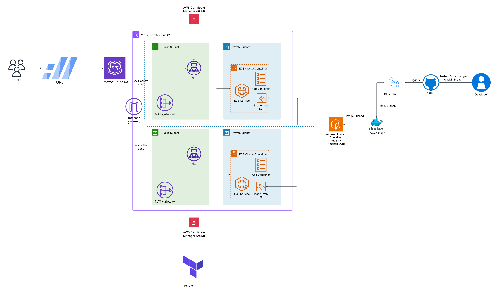
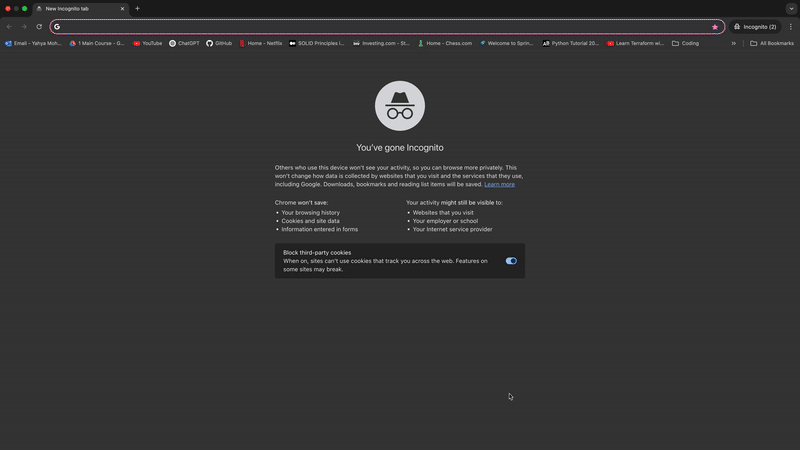

# 🌐 CoderCooks AWS Infrastructure

A production-ready cloud infrastructure setup that deploys a Node.js web application to AWS using ECS Fargate, ECR, ACM, ALB, Route 53, and Terraform — all managed through GitHub Actions CI/CD.

---

## 🧭 Table of Contents

- [🚀 Overview](#-overview)
- [📦 Project Structure](#-project-structure)
- [🧱 Infrastructure Components](#-infrastructure-components)
- [🛠️ Prerequisites](#️-prerequisites)
- [⚙️ Setup Instructions](#️-setup-instructions)
- [📸 Architectural Diagram](#-architectural-diagram)
- [🐳 Running with Docker](#-running-with-docker)
- [🛠️ Terraform Infrastructure Setup & Workflow](#️-terraform-infrastructure-setup--workflow)
- [🚀 CI/CD Pipeline Overview](#-cicd-pipeline-overview)
- [📚 Git Workflow Guide](#-project-git-workflow-guide)
- [🎯 Best Practices Implemented](#-best-practices-implemented)
- [🌐 Live Demo](#-live-demo)
- [🎥 Application Showcase](#-application-showcase)
- [📌 Future Improvements](#-future-improvements)
- [🧑‍💻 Author](#-author)

---

## 🚀 Overview

This project provisions the entire infrastructure stack for a scalable, containerized application hosted on AWS, and provides seamless domain routing with HTTPS using an ACM certificate. It leverages GitHub Actions workflows for infrastructure deployment automation.

---

## 📦 Project Structure

```
├── terraform/                  # Main Terraform configuration
├── modules/                   # Modular Terraform components (alb, ecs, route53, etc.)
├── .github/workflows/         # GitHub Actions CI/CD pipelines (ci, plan, apply and destroy)
├── coderco-app/               # Application Code, Dockerfile and supporting container files
├── public/architecture.png    # Architectural diagram (included below)
├── README.md                  # This file
```

---

## 🧱 Infrastructure Components

| Component          | Description                                        |
| ------------------ | -------------------------------------------------- |
| **ECS Fargate**    | Container orchestration with serverless deployment |
| **ECR**            | Docker image repository                            |
| **ALB + ACM**      | HTTPS load balancing and certificate management    |
| **Route 53**       | Domain routing and DNS management                  |
| **Terraform**      | Infrastructure as Code (IaC)                       |
| **GitHub Actions** | CI/CD automation for plan and apply workflows      |

---

## 🛠️ Prerequisites

- AWS CLI configured (`aws configure`)
- Terraform ≥ 1.3
- Docker
- Node.js (if running app locally)

---

## ⚙️ Setup Instructions

````bash
# 1. Clone the Repository
git clone https://github.com/your-org/your-repo.git
cd your-repo

# 2. Configure Terraform variables
# Create terraform/terraform.tfvars
# Example:
# domain_name = "domain.com"
# ecr_repo_name = "myecrrepo"
# subnet_ids = ["subnet-abc", "subnet-def"]
---

## 📸 Architectural Diagram



> This diagram outlines the high-level infrastructure on AWS: ECS Fargate handles compute, the ALB manages routing and HTTPS, and Route 53 maps the domain `www.tm-yahya.com` to the app.

---

## 🐳 Running with Docker

Test the frontend locally with Docker:

```bash
# 🔧 Build the Docker Image
docker build -t coderco-frontend .

# 🚀 Run the Container
docker run -p 3000:3000 coderco-frontend
````

Access the app at [http://localhost:3000](http://localhost:3000)

✅ Logs should show the app listening on port 3000 and loading correctly in the browser.

---

## 🛠️ Terraform Infrastructure Setup & Workflow

Terraform is used to provision and manage all AWS infrastructure.

- Remote state stored in **S3**
- Locking handled by **DynamoDB**
- Modular components under `modules/`

```bash
terraform init
terraform plan -var-file="terraform.tfvars"
terraform apply -var-file="terraform.tfvars"
terraform destroy -var-file="terraform.tfvars"
```

🔍 See backend.tf for state config.  
🧩 Modules include `alb`, `ecs`, `route53`.

Troubleshooting:

- 🔒 State lock? → Wait or clear DynamoDB lock
- 🔄 Plan recreating all? → Try `terraform refresh`

---

## 🚀 CI/CD Pipeline Overview

**GitHub Actions workflows:**

| Workflow      | Purpose                            | Trigger |
| ------------- | ---------------------------------- | ------- |
| `ci.yml`      | Build and push Docker image to ECR | Manual  |
| `plan.yml`    | Run `terraform plan`               | Manual  |
| `apply.yml`   | Apply infrastructure changes       | Manual  |
| `destroy.yml` | Destroy all infrastructure         | Manual  |

🔐 Uses `AWS_ACCESS_KEY_ID` and `AWS_SECRET_ACCESS_KEY` secrets for authentication.

Trigger via GitHub Actions tab → select workflow → "Run".

---

## 📚 Project Git Workflow Guide

### 🚦 Branching Strategy

- `main`: Production-ready
- `dev`: Integration branch
- `feature/*`: New features
- `bugfix/*`: Fixes
- `hotfix/*`: Urgent patches
- `chore/*`: Maintenance tasks

### 💾 Committing & Pull Requests

Use meaningful prefixes:

- `feat`, `fix`, `docs`, `style`, `chore`, etc.

Always:

- Rebase before pushing
- Create PRs to `dev`
- Use squash & merge

🔄 Keep `main` and `dev` updated regularly!

---

## 🎯 Best Practices Implemented

- ✅ Remote state with S3
- ✅ Locking with DynamoDB
- ✅ HTTPS via ACM
- ✅ Multi-stage Docker builds
- ✅ Secure networking (private/public subnets)
- ✅ Modular Terraform
- ✅ CI/CD via GitHub Actions
- ✅ TFLint and `terraform fmt`
- ✅ Clean Git strategy and PR review flow

---

## 🌐 Live Demo

- 🔗 [`https://www.tm-yahya.com`](https://www.tm-yahya.com)
- ✅ HTTPS-secured
- 🟢 Deployed via ECS Fargate

---

## 🎥 Application Showcase



> A running demo of the deployed application.

---

## 📌 Future Improvements

- 📊 Add CloudWatch or Datadog monitoring
- 🔁 Staging/production environment split
- 🚦 Add blue/green deployments

---

## 🧑‍💻 Author

**Yahya** — DevOps Engineer passionate about cloud infrastructure, automation, and CI/CD.

---
